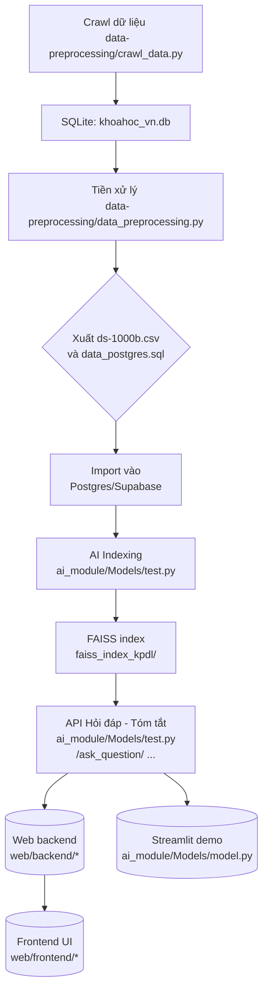

# 🚀 Dự án Khai phá dữ liệu báo khoa học Việt Nam

---

## 📖 Giới thiệu

**KhaiPhaDuLieu** là một hệ thống hoàn chỉnh nhằm tự động hóa quá trình thu thập, làm sạch, chuẩn hóa và khai thác thông tin từ kho dữ liệu báo khoa học ngành khoa học - công nghệ Việt Nam. Dự án tích hợp các pipeline tự động (Python 100%), dịch vụ trích xuất - tóm tắt bằng AI (RAG, Semantic Chunking, LLM), chỉ mục hoá kiến thức (FAISS) và giao diện web thân thiện cho người dùng cuối.

---

## 🎯 Mục tiêu & Tính năng nổi bật

- **Thu thập tự động** bài báo khoa học từ VJST, trích xuất PDF và metadata, chuẩn hóa lưu trữ tập trung.
- **Tiền xử lý & Làm sạch mạnh mẽ:** Loại bỏ noise, định dạng lại văn bản, trích phần nội dung chính, chuẩn Unicode.
- **Tóm tắt & hỏi đáp tự động bằng AI:** Sử dụng Google Gemini, Semantic Embeddings, RAG (Retrieval-Augmented Generation).
- **Chỉ mục tìm kiếm & QA tốc độ cao:** FAISS vector store, search context cho hỏi đáp và tổng hợp báo cáo.
- **Triển khai linh hoạt:** Có thể chạy batch/offline hoặc phục vụ API cho web frontend/backend.
- **Giao diện người dùng:** Streamlit demo và web-app (FastAPI backend + frontend).

---

## 📦 Kiến trúc & Workflow tổng quát



**Chú giải**:<br>
- <b>Xanh lam</b>: bước batch tự động (thu thập, cleaning, indexing).
- <b>Cam/Vàng</b>: bước AI dịch vụ xử lý, truy xuất chỉ mục, infer/QA.
- <b>Tím</b>: backend web và frontend trang người dùng cuối.

---

## 🗂️ Cấu trúc thư mục dự án

```
KhaiPhaDuLieu/
├── README.md                # Tài liệu hướng dẫn này
├── data-preprocessing/
│   ├── crawl_data.py        # Thu thập và trích xuất nội dung báo VJST
│   └── data_preprocessing.py # Tiền xử lý, làm sạch, xuất CSV/SQL
│
├── ai_module/Models/        # (nhánh ai_module)
│   ├── model.py             # Streamlit app tóm tắt trực tuyến
│   ├── test.py              # FastAPI Service: Hỏi đáp, tạo index, sinh summary...
│   ├── model.ipynb          # Thí nghiệm notebook AI
│   ├── requirements.txt     # Package dependencies
│   └── service_*/           # (Q&A, Summarize services)
│
├── web/                     # (nhánh web)
│   ├── docker-compose.yml   # Orchestration Docker cho backend/frontend/db
│   ├── backend/
│   │   └── app/             # FastAPI backend, routers, models, services
│   └── frontend/            # Web client (UI)
│
├── khoahoc_vn.db            # SQLite (artifact, sinh ra khi crawl)
├── ds-1000b.csv             # Data sạch (sinh ra khi preprocessing)
├── data_postgres.sql        # SQL import vào Postgres/Supabase
└── faiss_index_kpdl/        # FAISS index cho RAG (tạo khi chạy AI indexing)
```

---

## 🛠️ Hướng dẫn cài đặt & chạy thử

### 1. Thiết lập môi trường và cài dependencies

```bash
# Tạo môi trường ảo Python
python -m venv .venv
source .venv/bin/activate

# Cài đặt bắt buộc cho crawl/cleaning
pip install -r data-preprocessing/requirements.txt

# Module AI (embeddings, LLM)
pip install -r ai_module/Models/requirements.txt

# Web backend (FastAPI)
pip install -r web/backend/requirements.txt
```
**Biến môi trường cần thiết**  
Tạo file `.env` hoặc export các biến dưới đây:
```
GOOGLE_API_KEY=<Your_Google_Gemini_API_Key>
DATABASE_URL=<Postgres_or_Supabase_URL>
```

---

### 2. Pipeline cơ bản end-to-end

#### [A] Thu thập & làm sạch dữ liệu

```bash
# 1. Crawl bài báo (SQLite)
python data-preprocessing/crawl_data.py

# 2. Tiền xử lý & xuất dữ liệu sạch (CSV + SQL)
python data-preprocessing/data_preprocessing.py
```

#### [B] Import vào Database (Postgres/Supabase)

```bash
psql $DATABASE_URL -f data_postgres.sql
# hoặc dùng giao diện Supabase để import file SQL
```

#### [C] Khởi tạo AI Index/embeddings (FAISS)

```bash
cd ai_module/Models
uvicorn test:app --reload --port 8001

# Gọi API tạo chỉ mục FAISS từ DB
curl -X POST http://localhost:8001/process_kpdl/
```

#### [D] Kiểm thử hỏi đáp, tóm tắt AI (QA/Summary)

```bash
# Ví dụ hỏi đáp
curl -X POST http://localhost:8001/ask_question/ \
  -H "Content-Type: application/json" \
  -d '{"question":"Trình bày mục tiêu bài báo?", "chat_history":[]}'

# Tạo summary và lưu lịch sử
curl -X POST http://localhost:8001/generate_and_save_summary/ \
  -H "Content-Type: application/json" \
  -d '{"raw_text":"Nội dung mẫu cần tóm tắt ..."}'
```

#### [E] Demo UI (Streamlit hoặc Web-app)

```bash
# Chạy Streamlit demo nhanh cho tóm tắt/upload file
streamlit run model.py --server.port 8501

# Hoặc chạy toàn bộ backend/frontend qua Docker Compose
cd web
docker-compose up --build
```

---

## 🎛️ Các endpoint API chính (chi tiết hơn)

| Endpoint                                 | Chức năng                               | Method | Nhánh/Module                  |
|-------------------------------------------|-----------------------------------------|--------|-------------------------------|
| /upload_document/                         | Upload file (pdf/txt/png/jpg) & trích xuất, overview, Q&A | POST   | ai_module/Models/test.py      |
| /process_kpdl/                            | Đọc db, semantic chunking, build FAISS  | POST   | ai_module/Models/test.py      |
| /ask_question/                            | Hỏi đáp RAG từ FAISS & chat_history     | POST   | ai_module/Models/test.py      |
| /get_overview_and_questions/{paper_id}    | Sinh overview + 3 câu hỏi nhanh         | GET    | ai_module/Models/test.py      |
| /generate_and_save_summary/               | Sinh và lưu tóm tắt cho đoạn văn        | POST   | ai_module/Models/test.py      |

---

## 📝 Lưu ý triển khai & vận hành

- Nên sử dụng Postgres/Supabase để lưu trữ lâu dài và AI indexer hiệu quả.
- Giám sát FAISS, backup khoahoc_vn.db, user_history, kiểm soát quyền API.
- Có thể mở rộng: thêm queue (Celery/Redis) cho long-running jobs, thêm authentication cho backend.
- Regular job: cron/GitHub Actions để crawl + indexing định kỳ.

---

## 🚩 Đóng góp & phát triển mở rộng

- Fork, clone repo về, tạo branch cho tính năng mới, pull request kèm mô tả.
- Viết test cho các module mới.
- Góp ý, báo lỗi, ý tưởng cải tiến: tạo issue/new discussion.

---

## 📚 Tài liệu tham khảo trong repo
- `data-preprocessing/crawl_data.py`, `data_preprocessing.py`
- `ai_module/Models/model.py`, `test.py`, `model.ipynb`
- `web/backend/app/` (main.py, routers, services)
- `docker-compose.yml` (deploy orchestration)

---

## 📢 Bản quyền & liên hệ

Copyright (c)  
Repo: [HoaMatTroi224/KhaiPhaDuLieu](https://github.com/HoaMatTroi224/KhaiPhaDuLieu)

Thắc mắc, hợp tác, báo lỗi: [Issue](https://github.com/HoaMatTroi224/KhaiPhaDuLieu/issues)

---

**Chúc bạn sử dụng dự án hiệu quả và góp phần vào kho dữ liệu học thuật Việt Nam!**
