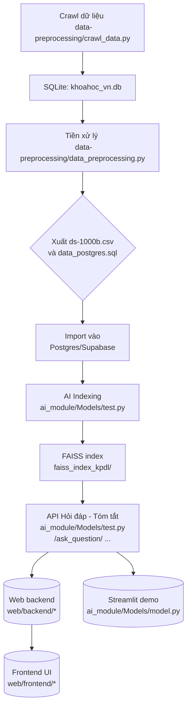

# 🌟 Dự án Khai phá Dữ liệu: Summarize Paper

---

## 📖 Giới thiệu

**KhaiPhaDuLieu** là một hệ thống tự động hóa toàn diện được thiết kế để thu thập, xử lý và khai thác thông tin từ dữ liệu báo khoa học tiếng Việt. Dự án sử dụng ngôn ngữ Python 100%, tích hợp các công nghệ tiên tiến bao gồm:
- **Trí tuệ nhân tạo (AI):** Hỗ trợ tóm tắt bài báo và hỏi đáp thông minh.
- **Xử lý dữ liệu lớn:** Làm sạch, chuẩn hóa và lưu trữ tập trung.
- **Giao diện người dùng hiện đại:** Gồm cả giao diện web và ứng dụng mobile.

---

## 🎯 Mục tiêu và Tính năng nổi bật

### Mục tiêu:
- Tự động hóa thu thập và quản lý bài báo khoa học.
- Xây dựng các dịch vụ AI để truy vấn và cung cấp thông tin nhanh chóng, chính xác.
- Hỗ trợ việc khai thác dữ liệu bài báo khoa học để phục vụ nghiên cứu.

### Tính năng nổi bật:
1. **Thu thập dữ liệu tự động:**
   - Crawl dữ liệu từ nguồn báo khoa học VJST, trích xuất PDF + metadata.
2. **Tiền xử lý mạnh mẽ:**
   - Làm sạch văn bản, chuyển đổi sang Unicode chuẩn.
3. **Tóm tắt và hỏi đáp bằng AI:**
   - Ứng dụng `VietAI/vit5-base` với LoRA và RAG index embedding.
4. **Triển khai linh hoạt:**
   - Chạy được cả offline (batch) và online (API backend và UI).
5. **Tìm kiếm nhanh chóng:**
   - Tích hợp FAISS để xây dựng vector embedding và truy vấn.

---

## 📦 Kiến trúc & Workflow

Dưới đây là luồng hoạt động của toàn bộ hệ thống:



Chi tiết:
1. **Xanh lam:** Quy trình batch tự động: crawl, làm sạch, indexing.
2. **Vàng:** Xử lý AI: RAG embedding, infer, hỏi đáp.
3. **Tím:** Giao diện cho người dùng qua web-app (với `FastAPI`, Next.js).

---

## 🗂️ Cấu trúc thư mục Dự án Chi Tiết

```plaintext
KhaiPhaDuLieu/
├── README.md                     # Hướng dẫn tổng quan dự án
├── docker-compose.yml            # Quản lý container hóa backend, frontend, DB
├── khoahoc_vn.db                 # SQLite file sinh ra từ quy trình crawl dữ liệu
├── ds-1000b.csv                  # Dữ liệu sạch sau khi tiền xử lý
├── data_postgres.sql             # Script SQL import lên PostgreSQL

├── data-preprocessing/           # Tiền xử lý dữ liệu
│   ├── README.md                 # Hướng dẫn cài đặt module này
│   ├── requirements.txt          # Các thư viện cần thiết (pandas, regex,...)
│   ├── crawl_data.py             # Script crawl và thu thập bài báo khoa học
│   ├── data_preprocessing.py     # Làm sạch và chuẩn hóa dữ liệu
│   └── utils/                    # Tiện ích hỗ trợ xử lý
│       ├── cleaning_util.py      # Hàm xử lý noise trong văn bản
│       ├── format_checker.py     # Kiểm tra định dạng Unicode
│       └── constants.py          # Cấu hình biến cố định (thư mục/format)

├── ai_module/                    # Các module AI hỗ trợ QA và tóm tắt
│   ├── Models/                   # Chính sách AI: inference, indexing...
│   │   ├── README.md             # Hướng dẫn tổng thể module AI
│   │   ├── requirements.txt      # Thư viện AI (transformers, faiss, ...)
│   │   ├── model.py              # Streamlit demo model hỏi đáp và tóm tắt
│   │   ├── test.py               # FastAPI: routing toàn bộ dịch vụ AI
│   │   ├── model.ipynb           # Thử nghiệm/ví dụ jupyter notebook
│   │   ├── service_qa/           # Module RAG QA Service
│   │   │   ├── README.md         # Tài liệu dịch vụ QA
│   │   │   ├── config/           # Cấu hình QA
│   │   │   ├── data_access/      # CRUD DB PostgreSQL/Supabase + xử lý metadata
│   │   │   ├── embedding/        # Xử lý vector embedding (E5 model)
│   │   │   ├── generation/       # RAG-based answer generator
│   │   │   └── serving/          # Endpoints chính (FastAPI)
│   │   ├── service_summarize/    # Module tóm tắt bài báo bằng tiếng Việt
│   │   │   ├── README.md         # Tài liệu dịch vụ Tóm tắt
│   │   │   ├── summarizer.py     # Chức năng chính để tóm tắt
│   │   │   ├── vit5_lora/        # Fine-tuned ViT5 base + LoRA adapter
│   │   │   └── pipeline/         # Quy trình giảm tokenize multi-doc
│   └── faiss_index_kpdl/         # FAISS chỉ mục RAG-based QA
│       ├── embeddings/           # Vector embeddings sinh sau preprocess
│       ├── faiss_index.bin       # FAISS thuật toán index trả lời nhanh
│       └── metadata.db           # Mapping id-chunk đến dữ liệu raw

├── web/                          # Giao diện Web cả backend lẫn frontend
│   ├── README.md                 # Tổng quan module Web
│   ├── docker-compose.override.yml # Tùy chỉnh config background service
│   ├── backend/                  # Django/FastAPI Backend
│   │   ├── app/                  # Application backend logic
│   │   │   ├── main.py           # Điểm vào chính của FastAPI
│   │   │   ├── routers/          # Tích hợp routes (upload, hỏi đáp, log...)
│   │   │   ├── models/           # Mô hình DB + Pydantic Validation
│   │   │   ├── services/         # Handlers API chính (QA, tóm tắt, ...)
│   └── frontend/                 # Frontend giao diện Next.js
│       ├── components/           # React Components (Giao diện UI nhỏ)
│       ├── pages/                # Routing chính Next.js
│       ├── ChatBox.tsx           # Nhập chat cho hỏi đáp AI
│       ├── FileUpload.tsx        # Khu vực upload file PDF
│       ├── Dashboard.tsx         # Hiển thị dự án/tài liệu cá nhân

├── mobile/                       # Ứng dụng di động Expo React Native
│   ├── README.md                 # Hướng dẫn sử dụng app
│   ├── package.json              # Cấu hình/yêu cầu dependencies
│   └── app/                      # Cấu trúc chính Expo
│       ├── pages/                # Các màn hình (Chính, dự án)
│       ├── components/           # React Native Components reusable
│       ├── App.js                # Điểm vào chính app React Native
│       └── routing/              # Xử lý điều hướng di động
```

---

## 🛠️ Hướng dẫn cài đặt và triển khai

### 1. Yêu cầu hệ thống
- **Ngôn ngữ lập trình:** Python 3.10+
- **Cơ sở dữ liệu:** PostgreSQL (hoặc Supabase)
- **Công cụ bổ trợ:** Docker, Node.js, npm

### 2. Các bước cài đặt

#### [A] Chuẩn bị môi trường
- Tạo môi trường ảo và cài đặt dependencies (python, npm). 
- Xem chi tiết tại từng `README.md` của các thư mục.

#### [B] Triển khai cục bộ/dùng Docker
- Chi tiết setup nằm tại các tệp hướng dẫn trong từng nhánh.

---

Hãy sử dụng README này để triển khai đồng bộ và phát triển dự án.
